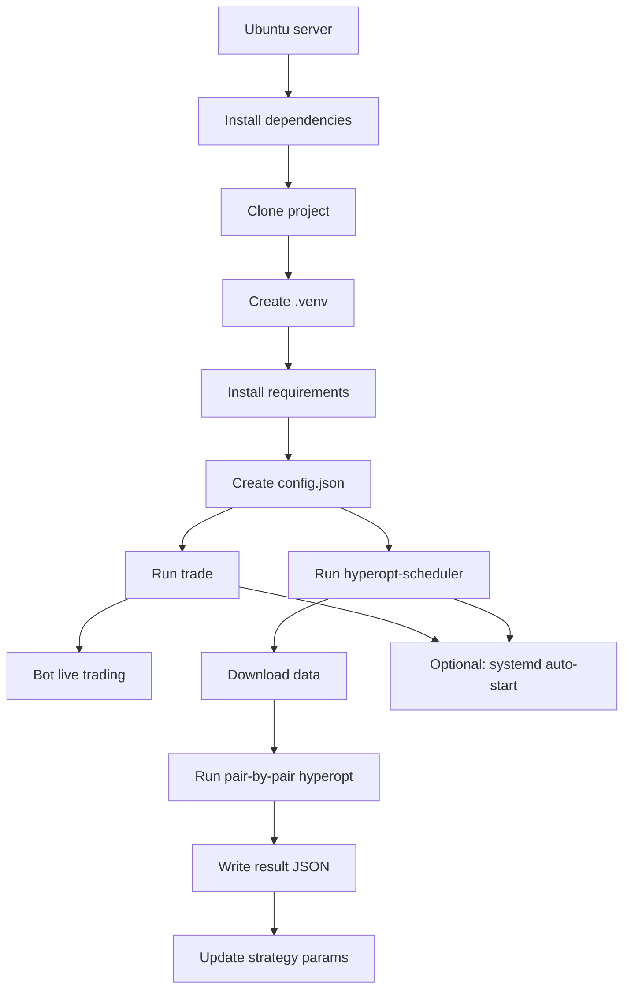

# 

[](https://github.com/freqtrade/freqtrade/actions/workflows/ci.yml)
[](https://doi.org/10.21105/joss.04864)
[](https://codecov.io/gh/freqtrade/freqtrade)
[](https://www.freqtrade.io)
[](https://discord.gg/p7nuUNVfP7)

Freqtrade is a free and open source crypto trading bot written in Python. It is designed to support all major exchanges and be controlled via Telegram or webUI. It contains backtesting, plotting and money management tools as well as strategy optimization by machine learning.


## Disclaimer

This software is for educational purposes only. Do not risk money which
you are afraid to lose. USE THE SOFTWARE AT YOUR OWN RISK. THE AUTHORS
AND ALL AFFILIATES ASSUME NO RESPONSIBILITY FOR YOUR TRADING RESULTS.

Always start by running a trading bot in Dry-Run and do not engage money
before you understand how it works and what profit/loss you should
expect.

We strongly recommend you to have coding and Python knowledge. Do not
hesitate to read the source code and understand the mechanism of this bot.

## Supported Exchange marketplaces

Please read the [exchange-specific notes](https://www.freqtrade.io/en/stable/exchanges/) to learn about special configurations that maybe needed for each exchange.

### Supported Spot Exchanges

- [X] [Binance](https://www.binance.com/)
- [X] [BingX](https://bingx.com/invite/0EM9RX)
- [X] [Bitget](https://www.bitget.com/)
- [X] [Bybit EU](https://bybit.eu/)
- [X] [Bybit](https://bybit.com/)
- [X] [Gate EU](https://www.gate.com/en-eu)
- [X] [Gate](https://www.gate.com/ref/6266643)
- [X] [HTX](https://www.htx.com/)
- [X] [Hyperliquid](https://hyperliquid.xyz/) (A decentralized exchange, or DEX)
- [X] [Kraken](https://kraken.com/)
- [X] [MyOKX](https://okx.com/) (OKX EEA)
- [X] [OKX](https://okx.com/)
- [ ] [potentially many others](https://github.com/ccxt/ccxt/). _(We cannot guarantee they will work)_

### Supported Futures Exchanges

- [X] [Binance](https://www.binance.com/)
- [X] [Bitget](https://www.bitget.com/)
- [X] [Bybit](https://bybit.com/)
- [X] [Gate](https://www.gate.com/ref/6266643)
- [X] [Hyperliquid](https://hyperliquid.xyz/) (A decentralized exchange, or DEX)
- [X] [Kraken](https://www.kraken.com/features/futures)
- [X] [OKX](https://okx.com/)

Please make sure to read the [exchange specific notes](https://www.freqtrade.io/en/stable/exchanges/), as well as the [trading with leverage](https://www.freqtrade.io/en/stable/leverage/) documentation before diving in.

### Community tested

Exchanges confirmed working by the community:

- [X] [Bitvavo](https://bitvavo.com/)
- [X] [Kucoin](https://www.kucoin.com/)

## Documentation

We invite you to read the bot documentation to ensure you understand how the bot is working.

Please find the complete documentation on the [freqtrade website](https://www.freqtrade.io).

## Features

- [x] **Based on Python 3.11+**: For botting on any operating system - Windows, macOS and Linux.
- [x] **Persistence**: Persistence is achieved through sqlite.
- [x] **Dry-run**: Run the bot without paying money.
- [x] **Backtesting**: Run a simulation of your buy/sell strategy.
- [x] **Strategy Optimization by machine learning**: Use machine learning to optimize your buy/sell strategy parameters with real exchange data.
- [X] **Adaptive prediction modeling**: Build a smart strategy with FreqAI that self-trains to the market via adaptive machine learning methods. [Learn more](https://www.freqtrade.io/en/stable/freqai/)
- [x] **Whitelist crypto-currencies**: Select which crypto-currency you want to trade or use dynamic whitelists.
- [x] **Blacklist crypto-currencies**: Select which crypto-currency you want to avoid.
- [x] **Builtin WebUI**: Builtin web UI to manage your bot.
- [x] **Manageable via Telegram**: Manage the bot with Telegram.
- [x] **Display profit/loss in fiat**: Display your profit/loss in fiat currency.
- [x] **Performance status report**: Provide a performance status of your current trades.

## Quick start

Please refer to the [Docker Quickstart documentation](https://www.freqtrade.io/en/stable/docker_quickstart/) on how to get started quickly.

For further (native) installation methods, please refer to the [Installation documentation page](https://www.freqtrade.io/en/stable/installation/).

## Linux server quick setup (step by step)

This is the simplest installation and startup guide for a Linux server. It covers installing the project, enabling the virtual environment, creating the config, launching the bot, and starting the scheduled Hyperopt service without manual terminal work.

### 1) Install prerequisites

```bash
sudo apt update
sudo apt install -y git python3 python3-venv python3-pip
```

### 2) Clone the project

```bash
cd /opt
git clone https://github.com/siroosab/freqtrade.git
cd freqtrade
```

### 3) Create the virtual environment

```bash
python3 -m venv .venv
source .venv/bin/activate
```

### 4) Install dependencies

```bash
pip install --upgrade pip
pip install -r requirements.txt
```

If you also want the development dependencies:

```bash
pip install -r requirements-dev.txt
```

### 5) Create the config file

```bash
cp user_data/config.example.json user_data/config.json
```

Then edit the config to include the strategy and scheduler settings:

```json
{
  "strategy": "SampleStrategy",
  "timeframe": "5m",
  "hyperopt_min_trades": 1,
  "hyperopt_loss": "SharpeHyperOptLossDaily",
  "hyperopt_scheduler": {
    "pairs": ["BTC/USDT:USDT", "ETH/USDT:USDT", "ADA/USDT:USDT"],
    "timeframes": ["5m"],
    "days": 30,
    "epochs": 20,
    "spaces": ["default"],
    "interval_hours": 24,
    "run_on_start": true
  }
}
```

### 6) Start the trading bot

```bash
freqtrade trade --config user_data/config.json --strategy SampleStrategy
```

This starts the live trading process only.

### 7) Start the scheduled hyperopt service

```bash
freqtrade hyperopt-scheduler --config user_data/config.json --strategy SampleStrategy
```

This starts the scheduler that runs pair-by-pair Hyperopt according to the values in `hyperopt_scheduler`.

### 8) Start both from one script without manual commands

Use a launcher script in the project root:

```bash
#!/usr/bin/env bash
set -euo pipefail

SCRIPT_DIR="$(cd -- "$(dirname -- "${BASH_SOURCE[0]}")" && pwd)"
cd "$SCRIPT_DIR"

CONFIG_FILE="$SCRIPT_DIR/user_data/config.json"
if [ ! -f "$CONFIG_FILE" ]; then
    echo "Config file not found: $CONFIG_FILE"
    exit 1
fi

if [ -f "$SCRIPT_DIR/.venv/bin/activate" ]; then
    . "$SCRIPT_DIR/.venv/bin/activate"
else
    echo "Virtual environment not found at $SCRIPT_DIR/.venv"
    exit 1
fi

LOG_DIR="$SCRIPT_DIR/logs"
mkdir -p "$LOG_DIR"

echo "Starting Freqtrade trade..."
nohup freqtrade trade --config "$CONFIG_FILE" --strategy SampleStrategy \
    >"$LOG_DIR/trade.log" 2>&1 &
TRADE_PID=$!
echo "$TRADE_PID" > "$LOG_DIR/trade.pid"

echo "Starting Freqtrade hyperopt scheduler..."
nohup freqtrade hyperopt-scheduler --config "$CONFIG_FILE" --strategy SampleStrategy \
    >"$LOG_DIR/hyperopt_scheduler.log" 2>&1 &
SCHEDULER_PID=$!
echo "$SCHEDULER_PID" > "$LOG_DIR/hyperopt_scheduler.pid"

printf '\nStarted successfully.\n'
printf 'Trade PID: %s\n' "$TRADE_PID"
printf 'Scheduler PID: %s\n' "$SCHEDULER_PID"
printf 'Logs:\n'
printf '  - %s\n' "$LOG_DIR/trade.log"
printf '  - %s\n' "$LOG_DIR/hyperopt_scheduler.log"
```

Save it as `start.sh`, then run:

```bash
chmod +x start.sh
./start.sh
```

This starts both processes together and keeps the logs in the `logs` folder.

### 9) Run automatically after reboot with systemd

Create `/etc/systemd/system/freqtrade-auto.service`:

```ini
[Unit]
Description=Freqtrade Auto Start (Trade + Scheduler)
After=network.target

[Service]
Type=simple
User=your_user
Group=your_user
WorkingDirectory=/home/your_user/your-project
ExecStart=/home/your_user/your-project/start.sh
Restart=always
RestartSec=30

[Install]
WantedBy=multi-user.target
```

Then:

```bash
sudo systemctl daemon-reload
sudo systemctl enable freqtrade-auto.service
sudo systemctl start freqtrade-auto.service
```

Check status:

```bash
sudo systemctl status freqtrade-auto.service
sudo journalctl -u freqtrade-auto.service -f
```

### 10) What happens after startup?

Once the service is running:

- the bot starts in trade mode
- the Hyperopt scheduler also starts
- if `run_on_start` is `true`, the first scheduled optimization begins immediately
- the scheduler repeats every `interval_hours`
- results are stored in `user_data/hyperopt_results/by_pair`
- pair overrides are written to the strategy JSON under `params.pairs`

### Flow diagram



## Automation and scheduled hyperopt

For users who want to keep the bot hands-off after installation, the safest setup is to run the bot and any periodic hyperopt refresh as background services instead of typing commands manually each time.

### Ubuntu: start trade and scheduler from one launcher

If you use a local virtual environment and normally run:

```bash
source .venv/bin/activate
```

then you can create a launcher script in the project root to start both the live trading bot and the scheduled hyperopt process without manual terminal interaction.

Create a file named `start.sh` in the project root:

```bash
#!/usr/bin/env bash
set -euo pipefail

SCRIPT_DIR="$(cd -- "$(dirname -- "${BASH_SOURCE[0]}")" && pwd)"
cd "$SCRIPT_DIR"

CONFIG_FILE="$SCRIPT_DIR/user_data/config.json"
if [ ! -f "$CONFIG_FILE" ]; then
    echo "Config file not found: $CONFIG_FILE"
    exit 1
fi

if [ -f "$SCRIPT_DIR/.venv/bin/activate" ]; then
    . "$SCRIPT_DIR/.venv/bin/activate"
else
    echo "Virtual environment not found at $SCRIPT_DIR/.venv"
    exit 1
fi

LOG_DIR="$SCRIPT_DIR/logs"
mkdir -p "$LOG_DIR"

echo "Starting Freqtrade trade..."
nohup freqtrade trade --config "$CONFIG_FILE" --strategy SampleStrategy \
    >"$LOG_DIR/trade.log" 2>&1 &
TRADE_PID=$!
echo "$TRADE_PID" > "$LOG_DIR/trade.pid"

echo "Starting Freqtrade hyperopt scheduler..."
nohup freqtrade hyperopt-scheduler --config "$CONFIG_FILE" --strategy SampleStrategy \
    >"$LOG_DIR/hyperopt_scheduler.log" 2>&1 &
SCHEDULER_PID=$!
echo "$SCHEDULER_PID" > "$LOG_DIR/hyperopt_scheduler.pid"

printf '\nStarted successfully.\n'
printf 'Trade PID: %s\n' "$TRADE_PID"
printf 'Scheduler PID: %s\n' "$SCHEDULER_PID"
printf 'Logs:\n'
printf '  - %s\n' "$LOG_DIR/trade.log"
printf '  - %s\n' "$LOG_DIR/hyperopt_scheduler.log"
```

Then run:

```bash
chmod +x start.sh
./start.sh
```

This is the simplest Linux-based solution if you want the bot to start in trading mode and the scheduled Hyperopt job to begin automatically from the same project environment, without manually entering commands each time.

### systemd auto-start on Ubuntu

If you want the same behavior after reboot, create a service file such as `/etc/systemd/system/freqtrade-auto.service`:

```ini
[Unit]
Description=Freqtrade Auto Start (Trade + Scheduler)
After=network.target

[Service]
Type=simple
User=your_user
Group=your_user
WorkingDirectory=/home/your_user/CUSTOM_freqtrade_spot
ExecStart=/home/your_user/CUSTOM_freqtrade_spot/start.sh
Restart=always
RestartSec=30

[Install]
WantedBy=multi-user.target
```

Then enable it:

```bash
sudo systemctl daemon-reload
sudo systemctl enable freqtrade-auto.service
sudo systemctl start freqtrade-auto.service
```

This keeps the bot and scheduler running in the background without any operator interaction after the system starts.

### Recommended configuration block

```json
"strategy": "SampleStrategy",
"timeframe": "5m",
"hyperopt_min_trades": 1,
"hyperopt_loss": "SharpeHyperOptLossDaily",
"hyperopt_scheduler": {
    "pairs": ["BTC/USDT:USDT", "ETH/USDT:USDT", "ADA/USDT:USDT"],
    "timeframes": ["5m"],
    "days": 30,
    "epochs": 20,
    "spaces": ["default"],
    "interval_hours": 24,
    "run_on_start": true,
    "log_level": "INFO",
    "log_summary_only": true
}
```

This keeps the scheduler configurable from config instead of hardcoding behavior into the code.

`hyperopt_min_trades` is important for short-run or small-sample optimization windows, because a value of `1` avoids failing hyperopt when the selected date range does not generate enough trades for the configured strategy.

- `interval_hours`: how often the scheduler reruns the hyperopt cycle.
- `run_on_start`: execute immediately when the background process starts.
- `log_level`: control how verbose the scheduler log is in the main bot log.
- `log_summary_only`: default summary entries only, to avoid noisy logs in production.

### Important runtime behavior

- The scheduler is intended to run as a long-lived background process.
- It repeats itself until the process is stopped, which is normal for a scheduler.
- For a one-off optimization run, use the regular hyperopt command instead of the scheduler.

### Per-pair JSON override model

The scheduler stores pair-specific hyperopt results in the strategy JSON file under `params.pairs`, and the strategy reads the matching override for each pair during live trading.

```json
{
  "strategy_name": "SampleStrategy",
  "params": {
    "buy": {"buy_rsi": 30},
    "pairs": {
      "BTC/USDT": {"buy": {"buy_rsi": 24}},
      "ETH/USDT": {"buy": {"buy_rsi": 35}}
    }
  }
}
```

This keeps the default strategy values as the global fallback while allowing different values per pair. The scheduler also downloads the informative timeframes required by the strategy before running hyperopt, so common `@informative` setups are available during optimization.

### Bot commands

```
usage: freqtrade [-h] [-V]
                 {trade,create-userdir,new-config,show-config,new-strategy,download-data,convert-data,convert-trade-data,trades-to-ohlcv,list-data,backtesting,backtesting-show,backtesting-analysis,edge,hyperopt,hyperopt-list,hyperopt-show,list-exchanges,list-markets,list-pairs,list-strategies,list-hyperoptloss,list-freqaimodels,list-timeframes,show-trades,test-pairlist,convert-db,install-ui,plot-dataframe,plot-profit,webserver,strategy-updater,lookahead-analysis,recursive-analysis}
                 ...

Free, open source crypto trading bot

positional arguments:
  {trade,create-userdir,new-config,show-config,new-strategy,download-data,convert-data,convert-trade-data,trades-to-ohlcv,list-data,backtesting,backtesting-show,backtesting-analysis,edge,hyperopt,hyperopt-list,hyperopt-show,list-exchanges,list-markets,list-pairs,list-strategies,list-hyperoptloss,list-freqaimodels,list-timeframes,show-trades,test-pairlist,convert-db,install-ui,plot-dataframe,plot-profit,webserver,strategy-updater,lookahead-analysis,recursive-analysis}
    trade               Trade module.
    create-userdir      Create user-data directory.
    new-config          Create new config
    show-config         Show resolved config
    new-strategy        Create new strategy
    download-data       Download backtesting data.
    convert-data        Convert candle (OHLCV) data from one format to
                        another.
    convert-trade-data  Convert trade data from one format to another.
    trades-to-ohlcv     Convert trade data to OHLCV data.
    list-data           List downloaded data.
    backtesting         Backtesting module.
    backtesting-show    Show past Backtest results
    backtesting-analysis
                        Backtest Analysis module.
    hyperopt            Hyperopt module.
    hyperopt-list       List Hyperopt results
    hyperopt-show       Show details of Hyperopt results
    list-exchanges      Print available exchanges.
    list-markets        Print markets on exchange.
    list-pairs          Print pairs on exchange.
    list-strategies     Print available strategies.
    list-hyperoptloss   Print available hyperopt loss functions.
    list-freqaimodels   Print available freqAI models.
    list-timeframes     Print available timeframes for the exchange.
    show-trades         Show trades.
    test-pairlist       Test your pairlist configuration.
    convert-db          Migrate database to different system
    install-ui          Install FreqUI
    plot-dataframe      Plot candles with indicators.
    plot-profit         Generate plot showing profits.
    webserver           Webserver module.
    strategy-updater    updates outdated strategy files to the current version
    lookahead-analysis  Check for potential look ahead bias.
    recursive-analysis  Check for potential recursive formula issue.

options:
  -h, --help            show this help message and exit
  -V, --version         show program's version number and exit
```

### Telegram RPC commands

Telegram is not mandatory. However, this is a great way to control your bot. More details and the full command list on the [documentation](https://www.freqtrade.io/en/stable/telegram-usage/)

- `/start`: Starts the trader.
- `/stop`: Stops the trader.
- `/stopentry`: Stop entering new trades.
- `/status <trade_id>|[table]`: Lists all or specific open trades.
- `/profit [<n>]`: Lists cumulative profit from all finished trades, over the last n days.
- `/profit_long [<n>]`: Lists cumulative profit from all finished long trades, over the last n days.
- `/profit_short [<n>]`: Lists cumulative profit from all finished short trades, over the last n days.
- `/forceexit <trade_id>|all`: Instantly exits the given trade (Ignoring `minimum_roi`).
- `/fx <trade_id>|all`: Alias to `/forceexit`
- `/performance`: Show performance of each finished trade grouped by pair
- `/balance`: Show account balance per currency.
- `/daily <n>`: Shows profit or loss per day, over the last n days.
- `/help`: Show help message.
- `/version`: Show version.


## Development branches

The project is currently setup in two main branches:

- `develop` - This branch has often new features, but might also contain breaking changes. We try hard to keep this branch as stable as possible.
- `stable` - This branch contains the latest stable release. This branch is generally well tested.
- `feat/*` - These are feature branches, which are being worked on heavily. Please don't use these unless you want to test a specific feature.

## Support

### Help / Discord

For any questions not covered by the documentation or for further information about the bot, or to simply engage with like-minded individuals, we encourage you to join the Freqtrade [discord server](https://discord.gg/p7nuUNVfP7).

### [Bugs / Issues](https://github.com/freqtrade/freqtrade/issues?q=is%3Aissue)

If you discover a bug in the bot, please
[search the issue tracker](https://github.com/freqtrade/freqtrade/issues?q=is%3Aissue)
first. If it hasn't been reported, please
[create a new issue](https://github.com/freqtrade/freqtrade/issues/new/choose) and
ensure you follow the template guide so that the team can assist you as
quickly as possible.

For every [issue](https://github.com/freqtrade/freqtrade/issues/new/choose) created, kindly follow up and mark satisfaction or reminder to close issue when equilibrium ground is reached.

--Maintain github's [community policy](https://docs.github.com/en/site-policy/github-terms/github-community-code-of-conduct)--

### [Feature Requests](https://github.com/freqtrade/freqtrade/labels/enhancement)

Have you a great idea to improve the bot you want to share? Please,
first search if this feature was not [already discussed](https://github.com/freqtrade/freqtrade/labels/enhancement).
If it hasn't been requested, please
[create a new request](https://github.com/freqtrade/freqtrade/issues/new/choose)
and ensure you follow the template guide so that it does not get lost
in the bug reports.

### [Pull Requests](https://github.com/freqtrade/freqtrade/pulls)

Feel like the bot is missing a feature? We welcome your pull requests!

Please read the
[Contributing document](https://github.com/freqtrade/freqtrade/blob/develop/CONTRIBUTING.md)
to understand the requirements before sending your pull-requests.

Coding is not a necessity to contribute - maybe start with improving the documentation?
Issues labeled [good first issue](https://github.com/freqtrade/freqtrade/labels/good%20first%20issue) can be good first contributions, and will help get you familiar with the codebase.

**Note** before starting any major new feature work, *please open an issue describing what you are planning to do* or talk to us on [discord](https://discord.gg/p7nuUNVfP7) (please use the #dev channel for this). This will ensure that interested parties can give valuable feedback on the feature, and let others know that you are working on it.

**Important:** Always create your PR against the `develop` branch, not `stable`.

## Requirements

### Up-to-date clock

The clock must be accurate, synchronized to a NTP server very frequently to avoid problems with communication to the exchanges.

### Minimum hardware required

To run this bot we recommend you a cloud instance with a minimum of:

- Minimal (advised) system requirements: 2GB RAM, 1GB disk space, 2vCPU

### Software requirements

- [Python >= 3.11](http://docs.python-guide.org/en/latest/starting/installation/)
- [pip](https://pip.pypa.io/en/stable/installing/)
- [git](https://git-scm.com/book/en/v2/Getting-Started-Installing-Git)
- [TA-Lib](https://ta-lib.github.io/ta-lib-python/)
- [virtualenv](https://virtualenv.pypa.io/en/stable/installation.html) (Recommended)
- [Docker](https://www.docker.com/products/docker) (Recommended)
